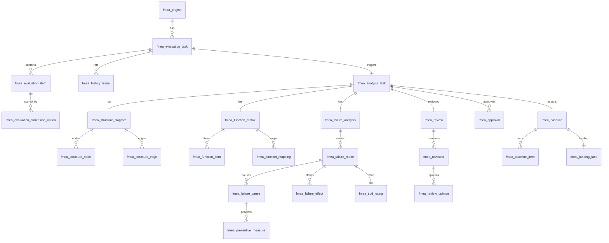
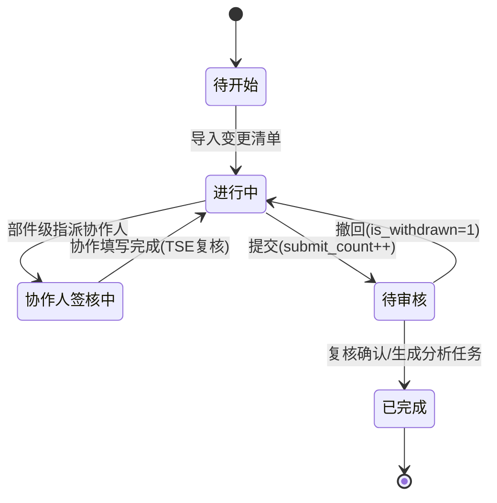
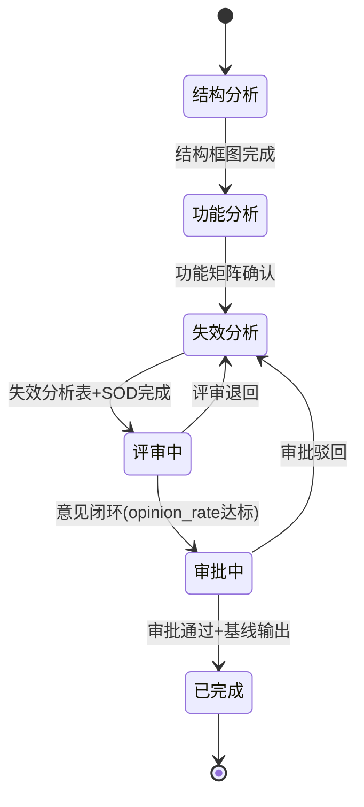

# FMEA 2.0 详细设计文档（V3）

> 版本：V3.0　适用范围：与 `fmea-prototype-v3` 原型一致的裁剪后系统
> 编制依据：《FMEA2.0-概要设计文档》《FMEA2.0-详细设计文档》《FMEA2.0-详细设计评审问题清单(V1.2)》《系统主页及菜单说明》
> 用途：**用于实际开发**，包含数据模型设计与功能实现逻辑
> 已并入评审问题清单结论：五维评分 高=10/中=5/低=3/没有=0；风险等级边界 H≥8、M(≥5且<8)、L<8 中 <5；评估维度采用 _option_id + _score 双字段；部件级无协作人签核（TSE 直接提交）；AI 重新生成仅删未采纳数据；启用 CSRF；SOD 模式一期统一规则。

---

## 1. 概述

### 1.1 文档目的

本文档在《FMEA2.0-详细设计文档》（全量）基础上，依据 `fmea-prototype-v3` 原型与《系统主页及菜单说明》进行裁剪，输出可直接指导开发的数据模型与功能实现逻辑。

### 1.2 模块清单（关键模块 / 基础模块）

| 模块类别 | 模块 | 说明 | 对应原型 |
|---|---|---|---|
| **关键模块** | DRBFM 触发评估 | 变更清单、质量匹配、历史问题、五维评分、评估结论 | eval-list / eval-process |
| **关键模块** | DRBFM 分析 | 结构分析、功能分析、失效分析（含 AI、SOD） | analysis-list / analysis-detail(步1-3) |
| **关键模块** | 评审与审批 | 评审人、评审意见、闭环、分级审批、基线输出 | analysis-detail(步4-5) |
| **基础模块** | 首页工作台 | 待办、指标、阶段与 AP 风险分布 | home |
| **基础模块** | 评审意见管理 | 我提出的 / 待我处理的、答复、闭环 | opinion-list |
| **基础模块** | 知识库 | 历史问题库（可用）、基线库/措施库（预留） | kb |
| **基础模块** | SOD 评价标准 | S/O/D 标准与 AP 判定查询 | sod-standard |
| **基础支撑** | 权限/PMS/飞书/AI/通知集成 | 通用能力 | 全局 |

### 1.3 相对全量设计的裁剪说明

| 全量模块 | V3 处理 |
|---|---|
| 项目管理（独立菜单） | 降级为 PMS 同步的基础数据，不设独立菜单 |
| 基线输出与落地跟踪（独立模块） | 基线输出嵌入审批后流程；落地项随审批生成，保留数据模型 |
| 入库管理 | 收敛为知识库（基线库/措施库预留入口） |
| DRBFM 迭代更新 | 一期不实现，移除 |
| 看板与统计 | 收敛为首页工作台 |
| 系统配置（独立模块） | 收敛为 SOD 评价标准查询 + fmea_configuration 支撑 |

---

## 2. 技术架构与分层约定

### 2.1 技术栈

| 层 | 技术 |
|---|---|
| 后端框架 | Spring Boot 2.7.x |
| ORM | MyBatis Plus 3.5.x |
| 数据库 | SQL Server 2019+（主库）；PMS 库只读（`@DS("pms")`） |
| 前端（生产） | EasyUI(jQuery) + FreeMarker(FTL) |
| 集成 | 飞书开放平台（文档/画板/表格/消息/通讯录）、AI 服务、PMS |

### 2.2 分层职责

| 层 | 职责 | 事务 | 跨模块 |
|---|---|---|---|
| Controller | 入参校验、鉴权、响应封装 | 无 | 否 |
| Provider | 业务编排、跨模块调用 | `@Transactional` | 是 |
| Service | 单模块业务 | 无（不开启事务） | 否 |
| Mapper | 模块内数据访问 | 无 | 否（仅本模块表） |

> 约定：跨模块写操作只能由 Provider 编排并统一开启事务；Service 不得开启事务；Mapper 不得跨模块访问表。

---

## 3. 数据模型设计

> SQL Server 适配：主键 `IDENTITY(1,1)`；字符串 `NVARCHAR`；大文本 `NVARCHAR(MAX)`；布尔 `BIT`；时间 `DATETIME2 DEFAULT GETDATE()`；更新时间由应用层维护。
> **飞书连接字段统一约定**：凡承载飞书画板/文档/电子表格的交付物表，均预留 `lark_obj_type`（board/docx/sheet）、`lark_doc_token`、`lark_app_token`、`lark_file_token`、`lark_node_token`、`lark_url`、`lark_sync_time` 字段。本版本已在 `fmea_structure_diagram`、`fmea_function_matrix`、`fmea_failure_analysis`、`fmea_evaluation_task`、`fmea_meeting_minutes` 中补齐。

### 3.1 数据模型总览（V3 保留表）

| 域 | 表 | 用途 | 飞书字段 |
|---|---|---|---|
| 项目/权限 | fmea_project | 项目（PMS 同步映射） | — |
| 项目/权限 | fmea_domain | 业务域/角色 | — |
| 项目/权限 | fmea_permission | 资源权限 | — |
| 评估 | fmea_change_list / fmea_change_list_item | 变更清单（多级） | — |
| 评估 | fmea_quality_plan | 质量策划 | — |
| 评估 | fmea_evaluation_task | 评估任务 | ✅ 评估表 |
| 评估 | fmea_evaluation_item | 评估项（五维双字段） | — |
| 评估 | fmea_evaluation_dimension_option | 维度选项 | — |
| 评估 | fmea_history_issue / fmea_history_issue_library | 历史问题 | — |
| 分析 | fmea_analysis_task | 分析任务 | — |
| 分析 | fmea_structure_diagram | 结构框图 | ✅ 画板 |
| 分析 | fmea_structure_node / fmea_structure_edge / fmea_interface_table | 结构节点/边/接口 | — |
| 分析 | fmea_function_matrix | 功能矩阵 | ✅ 表格 |
| 分析 | fmea_function_item / fmea_function_mapping | 功能项(is_change_related)/映射 | — |
| 分析 | fmea_failure_analysis | 失效分析表 | ✅ 表格 |
| 分析 | fmea_ai_generation_temp | AI 临时区 | — |
| 分析 | fmea_failure_mode / cause / effect | 失效模式/原因/影响 | — |
| 分析 | fmea_preventive/detection/optimization_measure | 三类措施 | — |
| 分析 | fmea_sod_rating | SOD 评分 | — |
| 标准 | fmea_sod_standard / fmea_ap_reference | SOD 标准/AP 参照 | — |
| 评审审批 | fmea_review / fmea_reviewer / fmea_review_opinion | 评审/评审人/意见 | — |
| 评审审批 | fmea_meeting_minutes | 会议纪要 | ✅ 文档 |
| 评审审批 | fmea_review_notification | 评审通知 | — |
| 评审审批 | fmea_approval | 审批 | — |
| 基线 | fmea_baseline / fmea_baseline_item | 基线/基线项 | — |
| 基线 | fmea_landing_task / fmea_landing_item / fmea_landing_audit / fmea_landing_deferred_history | 落地任务/项/审核/延期历史 | — |
| 知识库 | fmea_baseline_library(+version) / fmea_failure_library / fmea_measure_library / fmea_function_library | 库 | — |
| 支撑 | fmea_configuration | 系统配置 | — |

### 3.2 核心表 DDL（含本版本变更）

#### 3.2.1 评估域（评估表补充飞书字段；评估项五维改双字段）

```sql
-- 评估任务（补充飞书电子表格连接字段）
ALTER TABLE fmea_evaluation_task ADD
    lark_obj_type   NVARCHAR(10)  NULL,   -- sheet
    lark_doc_token  NVARCHAR(100) NULL,
    lark_file_token NVARCHAR(100) NULL,   -- 电子表格 token
    lark_url        NVARCHAR(500) NULL,
    lark_sync_time  DATETIME2     NULL;

-- 评估项：五维由单一 DECIMAL 改为「选项ID + 分值」双字段（评审问题 F-02）
CREATE TABLE fmea_evaluation_item (
    id                          BIGINT IDENTITY(1,1) PRIMARY KEY,
    task_id                     BIGINT NOT NULL,
    change_list_item_id         BIGINT NOT NULL,
    tech_novelty_option_id      BIGINT NULL,
    tech_novelty_score          INT    NULL,
    impact_scope_option_id      BIGINT NULL,
    impact_scope_score          INT    NULL,
    severity_option_id          BIGINT NULL,
    severity_score              INT    NULL,
    change_complexity_option_id BIGINT NULL,
    change_complexity_score     INT    NULL,
    history_issue_option_id     BIGINT NULL,
    history_issue_score         INT    NULL,
    risk_score                  DECIMAL(5,2) NULL,
    risk_level                  NVARCHAR(10) NULL,   -- H/M/L
    drbfm_suggestion            NVARCHAR(50) NULL,
    drbfm_suggestion_reason     NVARCHAR(MAX) NULL,
    drbfm_conclusion            NVARCHAR(50) NULL,
    created_time                DATETIME2 DEFAULT GETDATE(),
    updated_time                DATETIME2 DEFAULT GETDATE()
);
CREATE NONCLUSTERED INDEX idx_fmea_ei_task ON fmea_evaluation_item(task_id);
```

> 维度选项分值固定：高=10、中=5、低=3、没有=0；`*_score` 由所选 `*_option_id` 对应 `fmea_evaluation_dimension_option.risk_level` 映射写入。

#### 3.2.2 分析域（结构框图已含画板字段；功能矩阵、失效分析表补充飞书字段）

```sql
-- 结构框图（概要设计已含画板连接字段，V3 统一补 obj_type/sync_time）
ALTER TABLE fmea_structure_diagram ADD
    lark_obj_type  NVARCHAR(10) NULL DEFAULT 'board',
    lark_sync_time DATETIME2    NULL;
-- 既有：lark_doc_id / lark_board_id / lark_board_url

-- 功能矩阵（补充飞书电子表格连接字段）
ALTER TABLE fmea_function_matrix ADD
    lark_obj_type   NVARCHAR(10)  NULL,   -- sheet
    lark_file_token NVARCHAR(100) NULL,
    lark_url        NVARCHAR(500) NULL,
    lark_sync_time  DATETIME2     NULL;

-- 失效分析表（补充飞书电子表格连接字段，供评审查看）
ALTER TABLE fmea_failure_analysis ADD
    lark_obj_type   NVARCHAR(10)  NULL,
    lark_file_token NVARCHAR(100) NULL,
    lark_url        NVARCHAR(500) NULL,
    lark_sync_time  DATETIME2     NULL;

-- 功能项：增加「变更关联」标记，供 AI 读取变更相关功能生成失效（评审问题 F-03）
ALTER TABLE fmea_function_item ADD
    is_change_related BIT NOT NULL DEFAULT 0;
```

#### 3.2.3 评审审批域（会议纪要补充飞书文档字段）

```sql
ALTER TABLE fmea_meeting_minutes ADD
    lark_obj_type  NVARCHAR(10)  NULL DEFAULT 'docx',
    lark_doc_token NVARCHAR(100) NULL,
    lark_url       NVARCHAR(500) NULL,
    lark_sync_time DATETIME2     NULL;
```

#### 3.2.4 基线落地域（延期历史，评审问题 D-04/F-05）

```sql
-- 落地项增加延期次数
ALTER TABLE fmea_landing_item ADD
    deferred_count INT NOT NULL DEFAULT 0;

-- 延期历史表
CREATE TABLE fmea_landing_deferred_history (
    id              BIGINT IDENTITY(1,1) PRIMARY KEY,
    landing_item_id BIGINT NOT NULL,
    old_owner       NVARCHAR(64),
    new_owner       NVARCHAR(64),
    old_date        DATE,
    new_date        DATE,
    reason          NVARCHAR(MAX),
    created_by      NVARCHAR(64),
    created_time    DATETIME2 DEFAULT GETDATE()
);
CREATE NONCLUSTERED INDEX idx_fmea_ldh_item ON fmea_landing_deferred_history(landing_item_id);
```

> 其余表（fmea_structure_node/edge、function_item/mapping、failure_mode/cause/effect、各类 measure、sod_rating、sod_standard、ap_reference、review/reviewer/review_opinion、approval、baseline/baseline_item、landing_*、各库表、configuration）沿用《概要设计》第 6 章 DDL，本版本不做结构变更，仅在范围内保留使用。

### 3.3 关键字段说明

| 表.字段 | 说明 |
|---|---|
| fmea_evaluation_task.status | 待开始/进行中/协作人签核中/待审核/已完成；submit_count、is_withdrawn 控制重复提交与撤回 |
| fmea_evaluation_item.risk_level | 后端计算：H(≥8)、M(≥5且<8)、L(<5) |
| fmea_evaluation_dimension_option.risk_level | 高/中/低/没有，映射分值 10/5/3/0 |
| fmea_analysis_task.status | 结构分析/功能分析/失效分析/评审中/审批中/已完成 |
| fmea_ai_generation_temp.generation_type / is_adopted | 区分生成类型；未采纳项可被"重新生成"删除 |
| fmea_function_mapping.is_related / risk_level | 矩阵关联标记与风险着色 |
| fmea_sod_rating.mode_type | SOD 模式（一期统一规则，默认 2） |
| fmea_review.opinion_rate | 评审意见闭环率，作为提交审批前置条件 |
| fmea_reviewer.is_closed / conclusion | 评审人结论与闭环状态 |
| fmea_baseline_item.is_landing / landing_owner / landing_date / item_type | 基线项落地标记与责任人/日期 |

### 3.4 实体关系（核心）



---

## 4. 功能实现逻辑

### 4.1 DRBFM 触发评估

#### 4.1.1 评估任务生命周期



> 注：部件级评估**无需协作人签核**，TSE 复核后可直接提交（评审问题清单结论）。

#### 4.1.2 五维评分与风险计算（核心算法）

| 步骤 | 逻辑 |
|---|---|
| 1 选项映射 | 每个维度选择一个 `dimension_option`，其 `risk_level` ∈ {高,中,低,没有} 映射为分值 {10,5,3,0}，写入对应 `*_score` |
| 2 汇总 | `risk_score` 由五维分值按规则汇总（见下） |
| 3 定级 | `risk_level` = H 当 risk_score ≥ 8；M 当 5 ≤ risk_score < 8；L 当 risk_score < 5 |
| 4 建议 | H/M 给出"建议进入 DRBFM 分析"，L 给出"可不进入"，`drbfm_conclusion` 人工确认 |

风险分汇总（Provider 实现，后端唯一计算源）：

```text
score(dim) = map(option.risk_level)   // 高=10, 中=5, 低=3, 没有=0
risk_score = round( Σ score(dim_i) * weight_i , 2 )   // 五维加权；权重取自 fmea_configuration(config_type='eval_weight')
// 若未配置权重，默认等权：risk_score = 取五维加权后的归一化分（0~10 区间）
risk_level = riskScore >= 8 ? 'H' : (riskScore >= 5 ? 'M' : 'L')
```

> 前端只负责采集选项与展示结果，**不得在前端计算 risk_score/risk_level**（评审问题清单结论）。

#### 4.1.3 评估提交编排（Provider）

| 顺序 | 操作 | 表 |
|---|---|---|
| 1 | 校验五维齐全、变更清单非空；若有未完成项，返回 `incompleteItems`（未完成评估的行 change_list_item_id 列表）供前端定位（评审问题 G-01） | evaluation_item / change_list |
| 2 | 计算各项 risk_score/risk_level | evaluation_item |
| 3 | submit_count++，status→待审核 | evaluation_task |
| 4 | 复核确认后按 drbfm_conclusion 生成 analysis_task（关联 evaluation_task_id） | analysis_task |
| 5 | 写评估表飞书连接字段（如已生成在线表） | evaluation_task.lark_* |

### 4.2 DRBFM 分析

#### 4.2.1 分析任务状态机



#### 4.2.2 步骤一 结构分析

| 逻辑点 | 实现 |
|---|---|
| 结构框图载体 | 飞书文档画板，`fmea_structure_diagram` 持久化 lark_doc_id/lark_board_id/lark_board_url/lark_node_token |
| 从飞书画板同步 | 调用飞书画板读取接口，解析节点→`fmea_structure_node`，连线→`fmea_structure_edge`，更新 lark_sync_time |
| 从评估表生成 | 读取变更点清单无限层级树，按 ID 层级映射为结构节点（10→10.1→10.1.1，parent_id 按上级 ID 关联，level_num 取层级深度），评审问题 B-02/E-03 |
| 节点风险着色 | `fmea_structure_node.risk_level` 决定 H/M/L 颜色 |
| 接口表 | 由边生成 `fmea_interface_table`（source/target/function_desc/function_type） |

#### 4.2.3 步骤二 功能分析

| 逻辑点 | 实现 |
|---|---|
| 矩阵载体 | 飞书电子表格嵌入，`fmea_function_matrix` 持久化 lark_file_token/lark_url |
| 功能项 | 由边/节点生成 `fmea_function_item`（abundance_order、source=edge/manual） |
| 关联映射 | `fmea_function_mapping`（is_related=1 标记 Y，risk_level 着色） |
| 确认生成 | 确认矩阵→生成 `fmea_failure_analysis`（含飞书表格连接字段） |

#### 4.2.4 步骤三 失效分析（AI + SOD）

AI 生成与采纳逻辑：

| 步骤 | 逻辑 | 表 |
|---|---|---|
| 1 生成 | AI 读取功能矩阵中 `fmea_function_item.is_change_related=1` 的**变更相关功能**，生成失效模式/原因/预防/探测/优化措施 → 临时区 | fmea_ai_generation_temp(generation_type, is_adopted=0) |
| 2 采纳 | 用户采纳→将临时项**全部字段复制**到 failure_mode/cause/effect + measure 正式表（目标 ID 赋 NULL 由库自增），临时项 is_adopted=1（评审问题 C-03） | 正式表 |
| 3 重新生成 | **仅删除 is_adopted=0 的临时数据** 后重新生成，已采纳项不受影响 | 临时区 |
| 4 手工补充 | 用户可手工新增失效项（source=manual） | 正式表 |

SOD 评分逻辑（后端计算，AI 给建议）：

| 步骤 | 逻辑 |
|---|---|
| 1 | AI 给出 ai_suggested_s/o/d 写入 `fmea_sod_rating` |
| 2 | 用户可修改 S/O/D；后端按 `fmea_sod_standard`（scope/bg/mode_type/rating_type/level→score）校验取值 |
| 3 | 后端按 `fmea_ap_reference`（s_range/o_range/d_range→ap_level）计算 AP（H/M/L） |
| 4 | mode_type 一期统一规则（评审问题 E-06，模式一/二差异化二期实现） |

#### 4.2.5 飞书连接字段写入约定

| 交付物 | 写入时机 | 字段 |
|---|---|---|
| 结构框图 | 创建/同步画板时 | fmea_structure_diagram.lark_* |
| 功能矩阵 | 生成/打开在线表时 | fmea_function_matrix.lark_* |
| 失效分析表 | 生成失效分析表时 | fmea_failure_analysis.lark_* |
| 会议纪要 | 上传/创建纪要文档时 | fmea_meeting_minutes.lark_* |
| 评估表 | 生成在线评估表时 | fmea_evaluation_task.lark_* |

### 4.3 评审与审批

#### 4.3.1 评审逻辑

| 逻辑点 | 实现 |
|---|---|
| 评审人配置 | `fmea_reviewer`（role/user_id），用户从飞书通讯录解析为 open_id |
| 评审通知 | `fmea_review_notification` 按 notify_time 调度，飞书消息推送，sent 后置 is_sent=1 |
| 评审意见 | `fmea_review_opinion`（opinion_content/response/is_closed） |
| 闭环率 | opinion_rate = 已闭环意见数 / 总意见数；达阈值方可提交审批 |
| 会议纪要 | `fmea_meeting_minutes`（飞书文档连接字段） |
| 1 类项目 | is_level1_project 影响评审角色与流程分支 |

#### 4.3.2 审批逻辑

| 逻辑点 | 实现 |
|---|---|
| 前置 | 评审通过且 opinion_rate 达标 |
| 分级 | `fmea_approval.approval_level` 逐级，conclusion=通过/驳回 |
| 驳回 | 状态回退至失效分析，保留意见 |
| 通过 | 触发基线输出（见 4.4），analysis_task→已完成 |

### 4.4 基线输出与落地（嵌入审批后流程）

| 步骤 | 逻辑 | 表 |
|---|---|---|
| 1 | 审批通过后，汇总采纳的预防/探测/优化措施生成基线 | fmea_baseline(output_mode) |
| 2 | 逐措施生成基线项，标记 is_landing/landing_owner/landing_date/item_type(new/optimize) | fmea_baseline_item |
| 3 | 生成落地任务与落地项，设置 sla_date | fmea_landing_task / fmea_landing_item |
| 4 | 落地审核记录 | fmea_landing_audit |

> V3 不设独立"落地跟踪"菜单，但保留数据模型；落地项可在分析任务详情/审批后查看。

### 4.5 评审意见管理

| 逻辑点 | 实现 |
|---|---|
| 我提出的 | 查询当前用户作为 reviewer 提出的 review_opinion（含 response/is_closed） |
| 待我处理的 | 查询责任人为当前用户、is_closed=0 的意见；角标=未处理计数 |
| 答复 | 写入 response，状态→已答复 |
| 闭环 | 提出人确认→is_closed=1，回写 review.opinion_rate |

### 4.6 知识库

| 子库 | 实现 |
|---|---|
| 历史问题库 | `fmea_history_issue_library`，按 bg/domain/关键字检索分页 |
| 基线库 | `fmea_baseline_library(+version)`，V3 预留入口，占位展示 |
| 措施库 | `fmea_measure_library`，V3 预留入口，占位展示 |
| 功能库 | `fmea_function_library`，供功能项参考（预留） |

### 4.7 SOD 评价标准

| 逻辑点 | 实现 |
|---|---|
| 标准查询 | `fmea_sod_standard` 按 scope/bg_id/mode_type/rating_type(S/O/D)/level 分段返回 |
| AP 判定 | `fmea_ap_reference` 按 s_range/o_range/d_range 命中 ap_level |
| 一致性 | 失效分析 SOD 计算与本标准同源 |
| 模式差异 | 一期统一规则（E-06 已知限制） |

### 4.8 首页工作台

| 指标 | 来源逻辑 |
|---|---|
| 我的待办 | 聚合 evaluation_task(待我处理)、analysis_task(我负责)、review_opinion(待答复) |
| 进行中评估/分析 | status 过滤统计 |
| 待处理评审意见 | review_opinion is_closed=0 且责任人=我 |
| 阶段分布 | analysis_task.status 分组计数 |
| AP 风险分布 | sod_rating.ap_level 分组计数 |

---

## 5. 接口设计（核心，REST 约定）

> 统一响应：`{ code, message, data }`；分页：`{ pageNum, pageSize, total, list }`；启用 CSRF；鉴权按 fmea_permission。

| 模块 | 方法/路径 | 说明 |
|---|---|---|
| 评估 | GET /api/eval/tasks?level= | 评估任务列表 |
| 评估 | POST /api/eval/tasks | 新建评估 |
| 评估 | PUT /api/eval/tasks/{id}/items | 保存五维评分（后端计算风险） |
| 评估 | POST /api/eval/tasks/{id}/submit | 提交评估（submit_count++） |
| 评估 | POST /api/eval/tasks/{id}/withdraw | 撤回 |
| 分析 | GET /api/analysis/tasks?scope=mine\|all | 分析任务列表 |
| 分析 | GET /api/analysis/tasks/{id} | 分析详情（五步） |
| 分析 | POST /api/analysis/{id}/structure/sync | 从飞书画板同步结构 |
| 分析 | POST /api/analysis/{id}/function/confirm | 确认功能矩阵生成失效表 |
| 分析 | POST /api/analysis/{id}/failure/ai-generate | AI 生成失效 |
| 分析 | POST /api/analysis/{id}/failure/ai-regenerate | 重新生成（删未采纳） |
| 分析 | PUT /api/analysis/{id}/failure/{fid}/adopt | 采纳临时项 |
| 分析 | PUT /api/analysis/{id}/sod/{modeId} | 保存 SOD（后端算 AP） |
| 评审 | POST /api/analysis/{id}/review | 提交评审/意见 |
| 评审 | PUT /api/review/opinions/{id}/reply | 答复意见 |
| 评审 | PUT /api/review/opinions/{id}/close | 闭环意见 |
| 审批 | POST /api/analysis/{id}/approval | 提交/审批 |
| 基线 | GET /api/analysis/{id}/baseline | 查看基线/落地项 |
| 知识库 | GET /api/kb/history-issues | 历史问题库检索 |
| 标准 | GET /api/sod/standard | SOD 标准与 AP 判定 |
| 首页 | GET /api/home/workbench | 工作台聚合 |

---

## 6. 安全与非功能

| 项 | 说明 |
|---|---|
| CSRF | 启用（评审问题清单结论） |
| 鉴权 | 基于 fmea_permission（user/project/resource/permission_type） |
| 数据源 | PMS 只读 `@DS("pms")`，禁止写 |
| 审计 | 关键操作记录 created_by/updated_by 与时间 |
| 飞书降级 | lark_url 失效时给出降级提示，不阻断主流程 |
| 事务 | 跨模块写由 Provider 统一事务 |

---

## 7. 已知限制（来自评审问题清单未决项）

| 编号 | 限制 | 处理 |
|---|---|---|
| E-06 | SOD 模式一（设计）/模式二（过程/接口）差异化规则未定义 | 一期采用统一规则，mode_type 字段预留，二期细化 |
| H-02 | 性能指标（并发/响应时间）未量化定义 | 一期不设硬指标，按通用 Web 标准；二期补充压测目标 |

---

（详细设计文档 V3 完）
